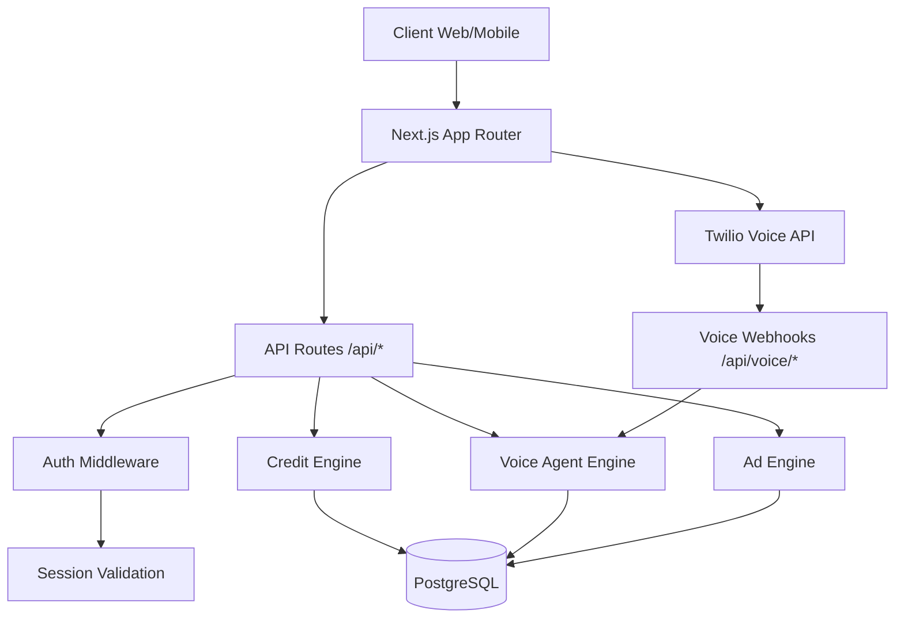

# Gen3ia — Architecture (v0.11+ — Firebase)

## Vue d'ensemble

Gen3ia est un SaaS multi-agents IA construit sur **Next.js 14 + Firebase**.

```
┌─────────────────────────────────────────────────────────────────┐
│                     Client (Browser / Mobile)                     │
│  ┌──────────────┐  ┌──────────────┐  ┌────────────────────────┐ │
│  │ Next.js RSC  │  │ React Client │  │ Firebase Client SDK    │ │
│  │ (Server Comp)│  │  Components  │  │ (Auth, Firestore, FCM) │ │
│  └──────────────┘  └──────────────┘  └────────────────────────┘ │
└─────────────────────────────────────────────────────────────────┘
                                │
                                ▼
┌─────────────────────────────────────────────────────────────────┐
│                  Next.js API Routes (Edge / Node)                 │
│  ┌─────────────────────────────────────────────────────────────┐ │
│  │ withAuth() wrapper → applySecurity()                        │ │
│  │  1. Session cookie Firebase  2. Bearer ID token             │ │
│  │  3. X-API-Key (Firestore)     4. RBAC (custom claims)       │ │
│  └─────────────────────────────────────────────────────────────┘ │
│  ┌─────────────────────────────────────────────────────────────┐ │
│  │ Firebase Admin SDK (singleton, serveur-only)                │ │
│  │  - Auth: verifySessionCookie, verifyIdToken, createUser     │ │
│  │  - Firestore: db.{model}.{findMany,create,update,...}       │ │
│  │  - Storage: uploadBuffer, getSignedUrl, deleteFile          │ │
│  │  - Messaging: sendPushToUser, sendPushToTopic               │ │
│  └─────────────────────────────────────────────────────────────┘ │
└─────────────────────────────────────────────────────────────────┘
                                │
                                ▼
┌─────────────────────────────────────────────────────────────────┐
│                        Firebase Project                          │
│  ┌────────────┐  ┌────────────┐  ┌────────────┐  ┌───────────┐ │
│  │Auth (scrypt)│  │ Firestore  │  │  Storage   │  │   FCM     │ │
│  │ MFA, OAuth  │  │ (NoSQL DB) │  │ (bucket)   │  │ (push)    │ │
│  └────────────┘  └────────────┘  └────────────┘  └───────────┘ │
│  ┌────────────────────────────────────────────────────────────┐ │
│  │ Security Rules (deny-by-default, ownership-based)           │ │
│  │  firestore.rules  |  storage.rules  |  firestore.indexes    │ │
│  └────────────────────────────────────────────────────────────┘ │
└─────────────────────────────────────────────────────────────────┘
```

## Mapping fonction → service Firebase

| Fonction Gen3ia | Service Firebase | Collection / Bucket |
|---|---|---|
| Comptes utilisateurs | Firebase Authentication | — (managed by Auth) |
| Profils utilisateurs étendus | Cloud Firestore | `users` (docId = uid) |
| Historique des conversations | Cloud Firestore | `conversations` + `messages/{id}/messages` |
| Crédits utilisateurs | Cloud Firestore | `credits` (docId = `credit_{uid}`) |
| Agents IA achetés / créés | Cloud Firestore | `agents` |
| Suites d'agents | Cloud Firestore | `agent_suites` |
| Mémoires d'agents | Cloud Firestore | `agent_memories` |
| Notifications intra-app + push | FCM + Cloud Firestore | `notifications` + `fcm_devices` |
| Fichiers / images | Cloud Storage | `uploads/{subdir}/...` |
| API keys | Cloud Firestore | `api_keys` |
| Audit logs | Cloud Firestore | `audit_logs` (admin-only) |
| Logs / analytics | Firebase Analytics + Cloud Firestore | `analytics_events`, `monitoring_events` |
| Logs coûts IA | Cloud Firestore | `ai_costs` |
| Sessions | Firebase Authentication | — (session cookies 14 jours) |

## Authentification (Firebase Auth)

### Flux de connexion

```
1. Client: signInWithEmailAndPassword(email, password)
   → Firebase Auth retourne un ID token (JWT, 1h)

2. Client: POST /api/auth/login { idToken }
   → Serveur: createSessionCookie(idToken, { expiresIn: 14j })
   → Serveur: setSessionCookie() (httpOnly, secure, sameSite=lax)
   → Serveur: sync profil Firestore (upsert users/{uid})

3. Requêtes suivantes:
   → Cookie gen3ia_session envoyé automatiquement
   → Middleware: verifySessionCookie() → decoded.uid
   → applySecurity(): AuthContext { userId, role, email }
```

### Providers supportés

- Email + mot de passe (scrypt, configurable dans Firebase Console)
- Google (via popup ou redirect)
- GitHub (via popup)
- MFA TOTP (via Firebase Auth MFA)
- Phone, Apple, Microsoft (configurable dans Firebase Console)

### Rôles (RBAC)

Stockés en tant que **custom claims** Firebase Auth :

```typescript
await auth.setCustomUserClaims(uid, { role: 'admin' });
// Accessible dans les security rules via request.auth.token.role
```

## Couche de données (Firestore)

### API Prisma-like

Pour préserver les ~50 API routes existantes, on expose une facade Prisma-like
sur Firestore :

```typescript
import { db } from '@/lib/db';  // shim → Firestore

// Find
const user = await db.user.findUnique({ where: { id: uid } });
const agents = await db.agent.findMany({
  where: [{ field: 'userId', op: '==', value: uid }],
  orderBy: [{ field: 'createdAt', direction: 'desc' }],
  limit: 20,
});
const count = await db.notification.count({ where: [...] });

// Create
const notif = await db.notification.create({ data: { ... } });
const profile = await db.user.createWithId(uid, { ... });

// Update / Delete
await db.user.update({ where: { id: uid }, data: { lastActiveAt: new Date() } });
await db.notification.delete({ where: { id } });
await db.notification.deleteMany({ where: [...] });

// Upsert
await db.usageDaily.upsert({ where: { id }, create: {...}, update: {...} });
```

### Collections Firestore

20+ collections mappées sur les modèles Prisma historiques :
`users`, `agents`, `agent_suites`, `agent_memories`, `agent_usage`,
`conversations`, `messages`, `credits`, `subscriptions`, `invoices`,
`api_keys`, `tasks`, `workflows`, `workflow_templates`, `guardrails`,
`notifications`, `audit_logs`, `improvement_logs`, `ai_costs`,
`monitoring_events`, `usage_daily`, `feedback`, `social_accounts`,
`webhooks`, `marketplace_listings`, `marketplace_purchases`,
`marketplace_reviews`, `uploaded_files`, `fcm_devices`.

### Index composites

Voir `firestore.indexes.json` — 18 index composites pré-configurés pour
les requêtes fréquentes (notifications par user+date, conversations par
user+updatedAt, marketplace_listings par status+date, etc.).

## Storage (Cloud Storage)

### Upload

```typescript
import { uploadFile, getSignedUrl } from '@/lib/upload';

const result = await uploadFile(file, 'avatars', {
  public: true,
  ownerUid: session.user.id,
  generateThumbnail: true,
});
// result.url = signed URL (1h) ou public URL si public: true
// result.path = 'uploads/avatars/1709xxxx-abc.png'
```

### Métadonnées

Chaque fichier stocke en customMetadata :
- `originalName`, `category`, `hash`, `ownerUid`

### Permissions

Voir `storage.rules` :
- Fichiers publics : `/public/**` (lecture tous, écriture authentifié)
- Avatars : `/avatars/{uid}/**` (lecture tous, écriture propriétaire)
- Uploads privés : `/uploads/{subdir}/{ownerUid}/**` (lecture/écriture propriétaire)

## Notifications (FCM + Firestore)

### Notification intra-app

```typescript
import { notificationEngine } from '@/lib/notification-engine';

await notificationEngine.create({
  userId: uid,
  type: 'agent.completed',
  title: 'Agent terminé',
  message: 'Votre agent a fini sa tâche',
  push: true,  // envoie aussi un push FCM
});
```

### Push multi-device

- Tokens enregistrés dans `fcm_devices/{token}` (userId, platform)
- `sendPushToUser()` : multicast à tous les devices de l'utilisateur
- `sendPushToTopic()` : broadcast thématique (ex: `agent-updates`)

## Analytics (Firebase Analytics + Firestore)

- **Client** : `trackClientEvent(eventName, params)` → Firebase Analytics SDK
- **Serveur** : `trackAgentUsage()`, `trackAICost()`, `logMonitoringEvent()` → Firestore
- **Audit** : `createAuditLog()` → collection `audit_logs` (admin-only)
- **Aggregation** : `aggregateDailyUsage()` → upsert `usage_daily/{uid_date}`

## Sécurité

### Defense in depth

1. **Middleware** (Layer 1) : vérifie session cookie Firebase, deny-by-default
2. **applySecurity()** (Layer 2) : authentification + RBAC
3. **Security Rules Firestore** (Layer 3) : ownership-based, deny-by-default
4. **Security Rules Storage** (Layer 4) : ownership-based

### CSP

Headers CSP durcis dans `src/middleware.ts` :
- `script-src 'self'` (ou `unsafe-inline` en dev)
- `connect-src` whitelist explicite (OpenAI, Anthropic, Firebase, Sentry)
- `frame-ancestors 'none'`, `object-src 'none'`

---

## Architecture historique (v0.10 et antérieur)

La version précédente utilisait PostgreSQL + Prisma, NextAuth (JWT custom,
argon2), filesystem uploads, notification engine custom. Tous ces modules
ont été remplacés par Firebase en v0.11+.

# Gen3ia — Architecture Guide

## Vue d'ensemble



## Boucle ReAct


## Role de BullMQ

BullMQ (via Redis) gere les taches asynchrones :
- Appels vocaux sortants
- Analyse post-appel
- Deductions de credits
- Notifications utilisateur

## Role de PostgreSQL

- Utilisateurs, sessions, agents
- Historique des conversations
- Transactions de credits
- Campagnes publicitaires
- Configurations Twilio

## Flux de deduction des credits


## Securite

- Toutes les cles API chiffrees avec AES-256-GCM
- Sessions utilisateur hachees avec SHA-256
- Rate limiting par IP (100 req/min)
- CSP strict dans le middleware
- Webhooks Twilio avec validation HMAC

## Deploiement

- Next.js App Router
- PostgreSQL (via Prisma ORM)
- Redis (file BullMQ, cache)
- Twilio (voix)
- n8n (integrations)
