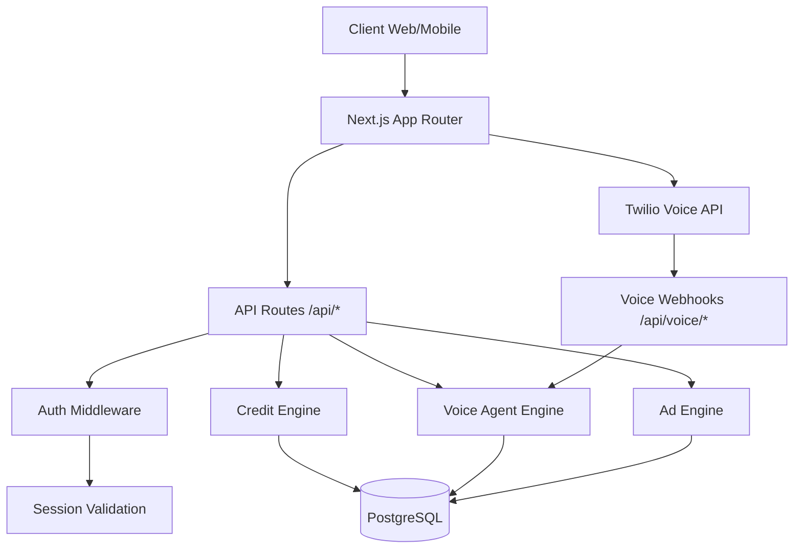
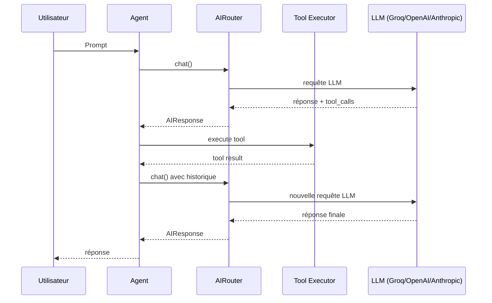
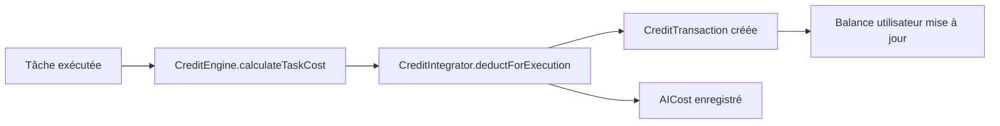

# Genova AI — Architecture Guide

## Vue d'ensemble

## Boucle ReAct

## Rôle de BullMQ

BullMQ (via Redis) gère les tâches asynchrones :
- Appels vocaux sortants
- Analyse post-appel
- Déductions de crédits
- Notifications utilisateur

## Rôle de PostgreSQL

- Utilisateurs, sessions, agents
- Historique des conversations
- Transactions de crédits
- Campagnes publicitaires
- Configurations Twilio

## Flux de déduction des crédits

## Sécurité

- Toutes les clés API chiffrées avec AES-256-GCM
- Sessions utilisateur hashées avec SHA-256
- Rate limiting par IP (100 req/min)
- CSP strict dans le middleware
- Webhooks Twilio avec validation HMAC

## Déploiement

- Next.js App Router
- PostgreSQL (via Prisma ORM)
- Redis (file BullMQ, cache)
- Twilio (voix)
- n8n (intégrations)
