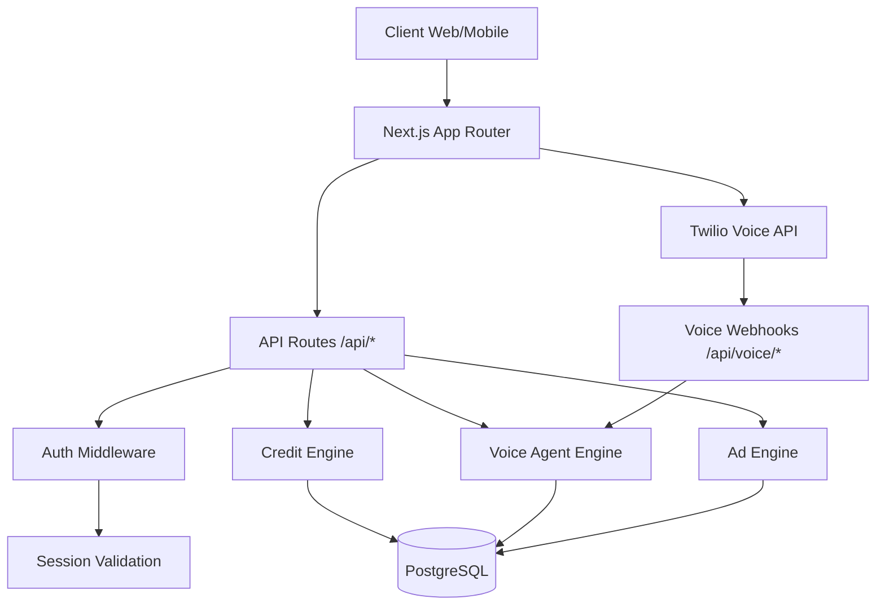

# Gen3ia — Architecture Guide

## Vue d'ensemble

## Boucle ReAct

## Role de BullMQ

BullMQ (via Redis) gere les taches asynchrones :
- Appels vocaux sortants
- Analyse post-appel
- Deductions de credits
- Notifications utilisateur

## Role de PostgreSQL

- Utilisateurs, sessions, agents
- Historique des conversations
- Transactions de credits
- Campagnes publicitaires
- Configurations Twilio

## Flux de deduction des credits

## Securite

- Toutes les cles API chiffrees avec AES-256-GCM
- Sessions utilisateur hachees avec SHA-256
- Rate limiting par IP (100 req/min)
- CSP strict dans le middleware
- Webhooks Twilio avec validation HMAC

## Deploiement

- Next.js App Router
- PostgreSQL (via Prisma ORM)
- Redis (file BullMQ, cache)
- Twilio (voix)
- n8n (integrations)
