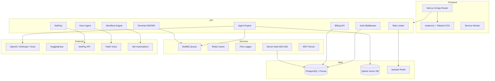
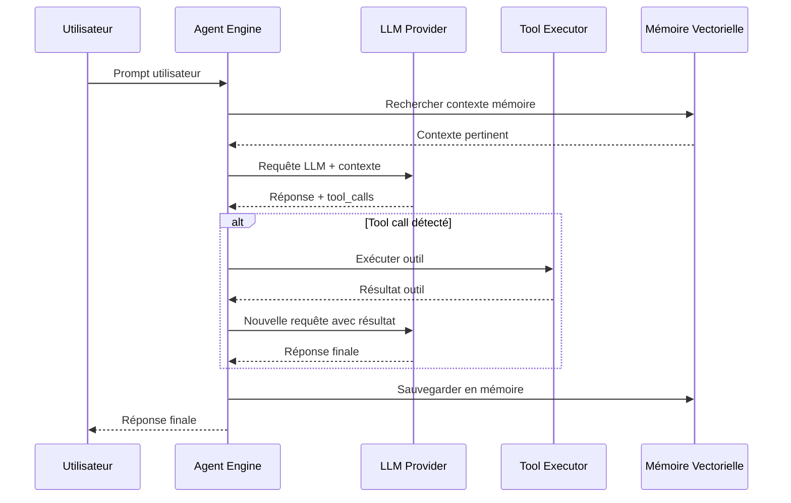

# 🤖 Gen3ia — AI Agent Operating System

**Plateforme SaaS d'agents IA autonomes** — Next.js 16 + Prisma + PostgreSQL + TypeScript

[](https://www.typescriptlang.org/)
[](https://nextjs.org/)
[](https://www.prisma.io/)
[](https://vitest.dev)
[](https://docker.com)
[](https://render.com)
[](LICENSE)
[](https://github.com/missock237-spec/Gen3ia/pulls)

---

## 📋 Table des matières

- [✨ Fonctionnalités](#-fonctionnalités)
- [🏗️ Architecture](#️-architecture)
- [🚀 Quick Start](#-quick-start)
- [🔧 Configuration](#-configuration)
- [📚 API](#-api)
- [💳 Paiements (SebPay)](#-paiements-sebpay)
- [🐳 Déploiement Docker](#-déploiement-docker)
- [☁️ Déploiement Render](#️-déploiement-render)
- [🧪 Tests](#-tests)
- [🌱 Seed (Données de démo)](#-seed-données-de-démo)
- [📄 Licence](#-licence)

---

## ✨ Fonctionnalités

| Domaine | Capacités |
|---------|-----------|
| 🤖 **Agents IA autonomes** | Boucle ReAct native (OpenAI/Anthropic/Groq), mémoire sémantique (Qdrant), outils web, supervision humaine |
| 🔄 **Workflows multi-étapes** | Automatisation avec dépendances, déclencheurs et files d'attente BullMQ |
| 💰 **Paiements Mobile Money** | Intégration SebPay pour l'Afrique — Orange Money, MTN MoMo, Wave, Carte Bancaire |
| 🖥️ **Terminal intelligent** | Exécution bash réelle, auto-complétion TAB, historique, sudo protégé, liste noire |
| 🔊 **Appels vocaux IA** | Twilio + Deepgram STT + ElevenLabs TTS — agents vocaux autonomes |
| 📊 **Monitoring** | Métriques Prometheus, logs structurés Pino, Sentry, tableaux de bord Grafana |
| 🛡️ **Sécurité** | CSP, HSTS, AES-256-GCM vault, rate limiting, validation Zod, OWASP Top 10 |
| 🔑 **API & MCP** | Clés API utilisateur, serveurs MCP personnalisables (Model Context Protocol) |
| 🎨 **Multimodal** | Génération d'images (HuggingFace), audio (ElevenLabs), vidéo via ComfyUI |
| 🌍 **Marketplace** | Agents et workflows communautaires, système de notation et d'évaluation |

---

## 🏗️ Architecture



### Boucle d'exécution ReAct



### Flux de paiement SebPay

```mermaid
flowchart LR
    U[Utilisateur] -->|Achat plan/crédits| Checkout[POST /api/payments/checkout]
    Checkout -->|Initie paiement| SebPay[SebPay API]
    SebPay -->|Notification| Webhook[/api/payments/webhook]
    Webhook -->|Vérifie HMAC| SebPayService
    SebPayService -->|Crédite| DB[(PostgreSQL)]
    DB -->|Solde mis à jour| U
```

---

## 🚀 Quick Start

### Prérequis

| Outil | Version |
|-------|---------|
| Node.js | ≥ 20.x |
| pnpm | ≥ 9.x (ou npm ≥ 10.x) |
| Docker | ≥ 24.x (recommandé) |
| PostgreSQL | ≥ 16 |

### Installation en 5 étapes

```bash
# 1. Cloner le projet
git clone https://github.com/missock237-spec/Gen3ia.git
cd Gen3ia

# 2. Installer les dépendances
# Le projet utilise pnpm (monorepo)
npm install -g pnpm@latest
pnpm install

# Alternative avec npm
npm install --legacy-peer-deps

# 3. Configurer l'environnement
cp .env.example .env.local
# Éditer avec vos clés : DATABASE_URL, AUTH_SECRET, OPENAI_API_KEY...

# 4. Lancer les services (PostgreSQL + Redis)
docker compose up -d postgres redis

# 5. Initialiser la base de données
pnpm db:generate   # npx prisma generate
pnpm db:push       # npx prisma db push
pnpm db:seed       # npx tsx prisma/seed.ts (optionnel)

# 6. Lancer le serveur de développement
pnpm dev

# Ouvrir http://localhost:3000 🎉
```

### Utilisateur administrateur (après seed)

| Rôle | Email | Mot de passe |
|------|-------|-------------|
| Admin | `admin@gen3ia.ai` | `Admin123!` |
| Démo | `demo@gen3ia.ai` | `Demo123!` |

---

## 🔧 Configuration

### Variables d'environnement essentielles

| Variable | Description | Requise |
|----------|-------------|:-------:|
| `DATABASE_URL` | Connexion PostgreSQL | ✅ |
| `REDIS_URL` | Connexion Redis | ✅ |
| `AUTH_SECRET` | Secret JWT (min 32 car.) | ✅ |
| `NEXT_PUBLIC_APP_URL` | URL publique du site | ✅ |
| `OPENAI_API_KEY` | Clé API OpenAI | ✅ |
| `ANTHROPIC_API_KEY` | Clé API Anthropic (Claude) | ❌ |
| `GROQ_API_KEY` | Clé API Groq (LLaMA) | ❌ |
| `HUGGINGFACE_API_KEY` | Génération d'images gratuite | ❌ |
| `GOOGLE_CLIENT_ID` | OAuth Google | ❌ |
| `GITHUB_CLIENT_ID` | OAuth GitHub | ❌ |

### Paiements SebPay (\(ex-Stripe\))

| Variable | Description |
|----------|-------------|
| `SEBPAY_API_KEY` | Clé API SebPay |
| `SEBPAY_API_SECRET` | Secret API SebPay |
| `SEBPAY_BASE_URL` | URL API (défaut: `https://api.sebpay.africa/v1`) |
| `SEBPAY_WEBHOOK_SECRET` | Secret HMAC pour webhooks |
| `SEBPAY_STARTER_PLAN_ID` | ID plan Starter |
| `SEBPAY_PRO_PLAN_ID` | ID plan Pro |
| `SEBPAY_ENTERPRISE_PLAN_ID` | ID plan Enterprise |

### Plans d'abonnement

| Plan | Prix FCFA | Prix USD | Crédits/mois | Agents |
|------|:---------:|:--------:|:------------:|:------:|
| **Free** | **0 FCFA** | $0 | 100 | 2 |
| **Starter** | **5 000 FCFA** | ~$9.99 | 1 000 | 5 |
| **Pro** ⭐ | **15 000 FCFA** | ~$29.99 | 5 000 | 20 |
| **Enterprise** | **50 000 FCFA** | ~$99.99 | Illimité | Illimité |

### Packs de crédits

| Pack | Crédits | Prix FCFA |
|------|:-------:|:---------:|
| Petit pack | 500 | 2 500 FCFA |
| Pack populaire | 2 000 | 8 000 FCFA |
| Grand pack | 5 000 | 18 000 FCFA |
| Pack Pro | 15 000 | 45 000 FCFA |

---

## 📚 API

### Endpoints principaux

| Méthode | Endpoint | Description |
|:-------:|----------|-------------|
| `GET` | `/api/health` | État du service |
| `GET` | `/api/metrics` | Métriques Prometheus |
| `POST` | `/api/agents/run` | Exécuter un agent (ReAct) |
| `POST` | `/api/terminal/execute` | Exécuter une commande |
| `GET` | `/api/billing` | Infos de facturation |
| `GET` | `/api/billing/credits` | Solde et historique crédits |
| `POST` | `/api/payments/checkout` | Initier un paiement SebPay |
| `POST` | `/api/payments/webhook` | Webhook SebPay (HMAC) |
| `POST` | `/api/payments/subscribe` | S'abonner via SebPay |

### Authentification

```http
# Toutes les routes /api/billing/* et /api/agents/* nécessitent
Authorization: Bearer <votre_token_jwt>
```

---

## 💳 Paiements (SebPay)

Gen3ia utilise **SebPay** pour les paiements Mobile Money en Afrique :

| Opérateur | Pays |
|-----------|------|
| 📱 **Orange Money** | Cameroun, Côte d'Ivoire, Sénégal, Mali, etc. |
| 📱 **MTN MoMo** | Cameroun, Ghana, Ouganda, Rwanda, etc. |
| 🌊 **Wave** | Sénégal, Burkina Faso, Côte d'Ivoire |
| 💳 **Carte Bancaire/Crédit** | Via l'API SebPay |

**Pas de Stripe** — Le projet a migré 100% vers SebPay pour servir le marché africain avec vérification d'identité simplifiée.

---

## 🐳 Déploiement Docker

```bash
# Stack complète (app + postgres + redis + qdrant)
docker compose up -d

# Avec proxy Traefik (HTTPS)
docker compose --profile proxy up -d

# Avec monitoring (Prometheus + Grafana)
docker compose -f docker-compose.dev.yml up -d
```

---

## ☁️ Déploiement Render

Le projet utilise **Render Blueprint** pour le déploiement automatique.

```yaml
# render.yaml (inclus dans le projet)
services:
  - type: web
    name: gen3ia-app
    runtime: image
    autoDeploy: true
    branch: main
    dockerfilePath: ./Dockerfile
    dockerContext: .
    healthCheckPath: /api/health
```

### 1 clic pour déployer

1. Allez sur [render.com](https://render.com) → **New Blueprint**
2. Connectez votre dépôt `missock237-spec/Gen3ia`
3. Render lit automatiquement `render.yaml` et crée les services
4. Configurez les **Environment Variables** dans le Dashboard Render

### Variables Render sensibles

```bash
DATABASE_URL, REDIS_URL, AUTH_SECRET, OPENAI_API_KEY
SEBPAY_API_KEY, SEBPAY_API_SECRET, SEBPAY_WEBHOOK_SECRET
GOOGLE_CLIENT_ID, GOOGLE_CLIENT_SECRET
```

> ⚠️ **Important** : Le champ `sync: false` dans `render.yaml` signifie que la variable doit être configurée manuellement dans le Dashboard Render.

---

## 🧪 Tests

```bash
# Tests unitaires (Vitest)
pnpm test

# Tests avec couverture (seuil 80%)
pnpm test:coverage

# Lint TypeScript
pnpm lint

# Type check
pnpm typecheck

# Audit de sécurité
npm audit
```

---

## 🌱 Seed (Données de démo)

```bash
pnpm db:seed
```

Crée :
- 👤 Admin : `admin@gen3ia.ai` / `Admin123!`
- 👤 Démo : `demo@gen3ia.ai` / `Demo123!`
- 🤖 3 agents IA de démonstration
- 💳 Abonnement Pro + crédits
- 📊 Données d'utilisation factices

---

## 🗺️ Roadmap

- [x] Agents IA avec boucle ReAct
- [x] Terminal intelligent avec exécution bash
- [x] Workflows multi-étapes
- [x] Paiements Mobile Money (SebPay)
- [x] Marketplace d'agents
- [x] Appels vocaux IA
- [x] MCP Server (Model Context Protocol)
- [ ] Compute GPU-like (WebGPU + WASM)
- [ ] Assistant vocal temps réel
- [ ] Génération vidéo avancée

---

## 📄 Licence

MIT — Développé avec ❤️ au 🇨🇲 Cameroun

---

<p align="center">
  <a href="ARCHITECTURE.md">📐 Architecture</a> ·
  <a href="CONTRIBUTING.md">🤝 Contribuer</a> ·
  <a href="CHANGELOG.md">📝 Changelog</a> ·
  <a href="SECURITY.md">🔒 Sécurité</a> ·
  <a href="https://github.com/missock237-spec/Gen3ia/issues">🐛 Signaler un bug</a>
</p>
