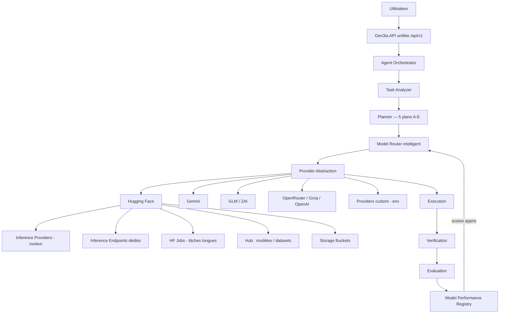
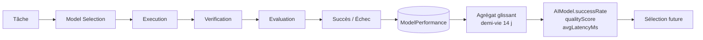

# GEN3IA v4.0 — Architecture Model & Compute Intelligence Layer

> Couche d'intelligence modèles et compute : Hugging Face comme infrastructure
> principale, l'orchestration GEN3IA comme cerveau.

## Vue d'ensemble

## Composants

| Composant | Fichier | Rôle |
|-----------|---------|------|
| Provider Abstraction | `src/lib/ai/providers/base.ts` | Contrat `ModelProvider` (generate/stream/embed/vision/healthCheck/estimateCost/listModels/getModelMetadata) — le cœur ne connaît JAMAIS une API fournisseur directement |
| Adapters | `src/lib/ai/providers/adapters.ts` | ZAI, GLM, OpenRouter, Groq, OpenAI (enrobent les implémentations existantes), Gemini natif, Custom (env) |
| HF Provider | `src/lib/ai/providers/huggingface.ts` | Inference Providers, streaming SSE, embeddings, vision, découverte Hub |
| HF Client | `src/lib/hf/client.ts` | HTTP typé : Hub API, routeur, Endpoints v2, Jobs, Buckets (endpoints réels documentés) |
| Model Registry | `src/lib/ai/model-registry.ts` | Table `AIModel` + capacités ; évolue sans code (seed idempotent, sync HF Hub, édition admin) |
| Model Router v2 | `src/lib/ai/router-v2.ts` | TaskContext → score pondéré (adéquation 0.30, réussite 0.22, qualité 0.16, capacité 0.12, disponibilité 0.08, latence 0.07, coût 0.05) → sélection + raison + alternatives + confiance |
| Performance Registry | `src/lib/ai/performance.ts` | ModelPerformance + agrégat glissant (demi-vie 14 j) → AIModel.successRate/qualityScore/latence → boucle d'apprentissage |
| 5 plans diversifiés | `src/lib/engines/planner.ts` | `selectModelDiversity()` assigne un modèle différent par plan (A→E) |
| Compute Scheduler | `src/lib/compute/scheduler.ts` | Choix hf-router / hf-endpoint / hf-job / external selon VRAM, durée, priorité, coût |
| HF Jobs Manager | `src/lib/hf/jobs.ts` + `job-queue.ts` | File BullMQ dédiée `gen3ia-hf-jobs`, statuts PENDING→RUNNING→COMPLETED/FAILED/CANCELLED, idempotence, checkpoints |
| HF Storage | `src/lib/hf/storage.ts` | 11 buckets logiques (repos datasets privés HF) : upload/download/list/move/copy/mount/delete + métadonnées PG |
| VectorStore | `src/lib/rag/backends/` | Abstraction json (portable) / pgvector (Supabase) / qdrant (grande échelle), fail-open json |

## Boucle d'apprentissage (Phase 8)

Chaque appel LLM (`chat()`/`chatJSON()`) alimente automatiquement le
Performance Registry — succès comme échecs. Après quelques exécutions, le
routeur privilégie les modèles réellement efficaces pour chaque catégorie de
tâche (coding, research, reasoning, vision, RAG…).

## API unifiée (Phase 20)

| Endpoint | Méthodes | Usage |
|----------|----------|-------|
| `/api/v1/models` | GET | Registre (coûts, capacités, scores appris) |
| `/api/v1/models/select` | POST | Décision de routage justifiée (sans exécuter) |
| `/api/v1/embeddings` | POST | Embeddings facturés au crédit |
| `/api/v1/files` | GET/POST/DELETE | Objets Bucket HF (octets chez HF) |
| `/api/v1/files/download` | GET | Passe-relais authentifié (token HF jamais exposé) |
| `/api/v1/knowledge` | GET/POST/PUT | Documents + ingestion + recherche RAG hybride |
| `/api/v1/jobs` | GET/POST/PATCH | Jobs longs (cancel/poll/drain) |

Spécification OpenAPI 3.1 : `GET /api/openapi.json` — Swagger UI : `/docs/api`.

## Séparation des données (Phase 14)

| Stockage | Contenu |
|----------|---------|
| PostgreSQL / Supabase | utilisateurs, agents, conversations, abonnements, crédits, permissions, configurations, logs métier, **métadonnées** StorageObject |
| HF Bucket (repos datasets privés) | fichiers, datasets, checkpoints, artefacts, gros objets |
| Qdrant | recherche vectorielle à grande échelle |
| Supabase pgvector | recherche vectorielle intégrée aux données applicatives |
| Table `Embedding` (json) | repli portable garanti (SQLite comme Postgres) |

## Résilience (Phase 24)

Chaîne de repli effective : HF routeur → HF endpoint dédié (si registre) →
Gemini → GLM/ZAI → OpenRouter → Groq → OpenAI → réponse d'échec explicite
(fail-closed, jamais de faux succès). Circuit breakers par outil et par
provider (ProviderHealth persistant + EngineRun LLM::*).
